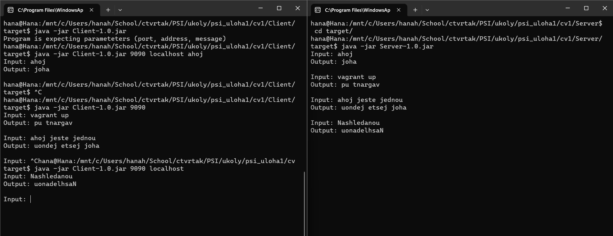

# PSI - úloha 1 
Hana Hrkalová

23.3.2023

## Přeložení a spuštění programu
Klient i server je naprogramován a překládán v Javě (verze 11).
Pokud pro spuštění programu není nainstalovaná verze Javy 11, lze verzi změnit v souborech *pom.xml*

    <properties>
            <maven.compiler.source>11</maven.compiler.source>
            <maven.compiler.target>11</maven.compiler.target>
    </properties>

Program se přeloží pomocí příkazu: 

    mvn clean install

Příkaz se musí provést jak pro klientskou aplikaci, tak pro server aplikaci. Konkrétně v adresáři, kde se nachází *pom.xml* soubory.

Soubory jar se vytvoří v adresářích 

    \..\Client\target\Client-1.0.jar
    
    \..\Server\target\Server-1.0.jar

Následně lze spustit jar soubory

    java -jar Server-1.0.jar
    java -jar Client-1.0.jar

## Popis programu
Program může běžet ve třech režimech. Volba režimu se odvíjí od předaných parametrů, chování programu je pak na stejný princip.

Uživatel předá serveru zprávu, server zkontroluje, zda délka zprávy předaná klientem odpovídá reálné délce zprávy a pošle ji klientovi nazpět v opačném pořadí znaků. 

##Klient
### 1. režim
Pokud uživatel zadá pouze jeden parametr, tedy port, program se spustí na adrese *localhost* a vyzve uživatele k předání zprávy.
### 2. režim
Pokud uživatel zadá dva parametry (port a adresu), je uživatel opět vyzván k zadání zprávy po spuštění.
### 3. režim
Uživatel zadá 3 parametry (port, adresu a zprávu), program rovnou splňuje požadovanou akci s předanou zprávou.

## Server
Pokud se jar souboru serveru nepředají žádné parametry, běží automaticky na portu 9090. Může se serveru předat port přes parametr.

### Output programu
